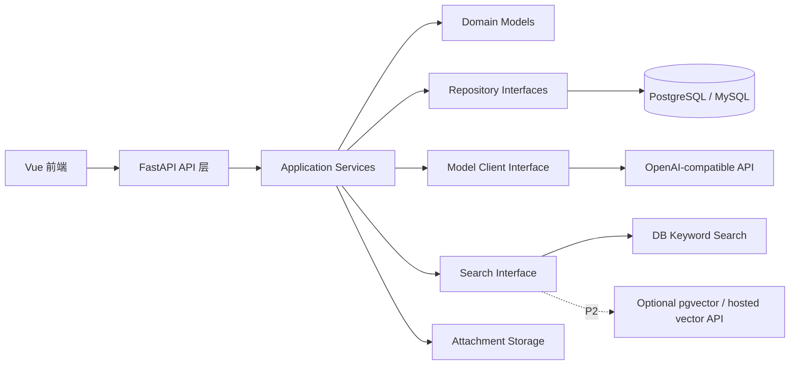

# NoteWeave 架构文档

## 1. 文档目标

本文档基于 `docs/需求文档.md` 和仓库内 `MoDora/` 项目进行架构设计，目标是说明 NoteWeave 如何借鉴 MoDora 的分层、知识树、检索和 AI 编排思路，开发课程笔记协作系统。

NoteWeave 只提供 API 方式的大模型访问，因此不引入 MoDora 中的本地模型启动、OCR、PDF 裁剪、GPU 调度、实验评测等重依赖。AI 能力在系统中作为可关闭的增强模块，失败时不影响课程、笔记、错题、共享和基础检索。

## 2. 需求摘要

NoteWeave 的核心闭环是：

```text
用户登录 -> 创建/加入课程 -> 维护课程知识树 -> 创建笔记/错题 -> 共享互动 -> 检索复习 -> AI 辅助整理
```

MVP 必须覆盖：

1. 用户注册、登录、角色权限。
2. 课程创建、加入、成员角色管理。
3. 课程、章节、知识点树的增删改查和排序。
4. 支持文本、代码、公式、图片的笔记编辑与归档。
5. 错题录入、标签分类、掌握状态筛选。
6. 课程内共享、点赞、评论、补充、纠错。
7. 关键词、章节、知识点、标签检索。
8. AI 摘要和关键词标签提取，且结果可人工确认。

## 3. 从 MoDora 借鉴什么

MoDora 的主要价值不在 PDF/OCR 能力本身，而在“把内容组织成树，再围绕树做检索、编辑、AI 处理和可视化”的架构方式。

| MoDora 能力 | NoteWeave 借鉴方式 |
| --- | --- |
| `core / interfaces / infra / api` 分层 | 后端也采用核心业务、外部能力接口、基础设施实现、API 入口分层，避免 API 路由直接写业务逻辑 |
| CCTree 文档树 | 改造为课程知识树 `CourseKnowledgeTree`，节点为课程、章节、知识点，挂载笔记、错题、标签和讨论 |
| `TreeNode` 与 Vue Flow 转换 | 复用“树结构 <-> 前端图元素”的思路，实现知识树可视化、拖拽调整和节点详情 |
| `metadata`、`impact` 字段 | `metadata` 用于节点摘要、关键词、说明；`impact` 用于记录检索命中/浏览热度，支持知识点热力提示 |
| `QAService` 的检索-生成编排 | 改造为 `SearchService` 和 `AIAssistService`，先返回可解释的笔记/错题片段，再按需生成摘要或标签 |
| `TaskStatusStore` 后台任务状态 | 用于 AI 摘要、关键词提取、搜索索引刷新等异步任务 |
| OpenAI-compatible remote client | 保留远程模型适配器，统一封装摘要、标签、重组知识树等 API 调用 |
| 前端三栏体验 | 借鉴“侧边栏 + 主内容区 + 右侧树/详情面板”，但内容从 PDF QA 改为课程笔记协作 |

## 4. 不从 MoDora 照搬什么

以下模块与 NoteWeave 的 MVP 目标不匹配，或会显著增加部署成本：

| MoDora 模块/依赖 | NoteWeave 处理 |
| --- | --- |
| PaddleOCR、PaddleX、PPStructure | 不引入。NoteWeave 的主要输入是用户编辑的结构化笔记，不以 PDF 版面解析为主 |
| PyMuPDF PDF 裁剪、图片 bbox 定位 | 不作为核心能力。图片只作为笔记附件存储和展示 |
| transformers、lmdeploy、huggingface_hub、本地模型进程 | 不引入。只调用远程 API 模型 |
| nvidia-ml-py、GPU 设备配置 | 不需要 GPU 资源管理 |
| OpenCV、复杂图像处理 | MVP 不需要 |
| ChromaDB 向量库 | MVP 先用数据库关键词检索；后续如需向量检索，优先用 PostgreSQL `pgvector` 或托管向量服务 |
| 实验 CLI、数据集、评测脚本 | 不进入产品主链路 |

## 5. 总体架构



建议采用前后端分离：

| 层 | 方案 |
| --- | --- |
| 前端 | Vue 3 + Vite + Pinia/组合式状态管理，借鉴 MoDora Vue Flow 树组件思路 |
| 后端 | FastAPI + Pydantic + SQLAlchemy/SQLModel + Alembic |
| 数据库 | PostgreSQL 优先；课程项目场景也可用 MySQL，但全文检索和 `pgvector` 扩展性不如 PostgreSQL |
| 文件存储 | MVP 使用本地磁盘目录；后续替换为 S3/OSS 兼容存储 |
| AI | OpenAI-compatible API client；摘要、标签、知识树建议均走远程 API |
| 后台任务 | MVP 使用 FastAPI BackgroundTasks 或轻量任务表；后续可换 RQ/Celery |

## 6. 后端分层设计

推荐目录结构：

```text
backend/
  src/noteweave/
    api/
      app.py
      deps.py
      v1/
        auth.py
        courses.py
        tree.py
        notes.py
        mistakes.py
        collaboration.py
        search.py
        ai.py
        files.py

    core/
      domain/
        user.py
        course.py
        knowledge_tree.py
        note.py
        mistake.py
        collaboration.py
        ai_result.py
      services/
        auth_service.py
        course_service.py
        tree_service.py
        note_service.py
        mistake_service.py
        collaboration_service.py
        search_service.py
        ai_assist_service.py
      interfaces/
        repositories.py
        model_client.py
        search_index.py
        file_storage.py
      prompts/
        summary.py
        tags.py
        tree.py
      settings.py

    infra/
      db/
        models.py
        session.py
        repositories.py
      llm/
        remote.py
        factory.py
      search/
        db_search.py
      storage/
        local.py
      logging/
        setup.py
        context.py
```

依赖方向：

```text
api -> core.services -> core.domain / core.interfaces <- infra
```

约束：

1. API 层只做请求解析、认证依赖、响应格式化。
2. 业务规则写在 `core/services`。
3. 数据库、模型 API、文件系统等外部能力通过 `interfaces` 注入。
4. AI 和检索必须可替换、可关闭。

## 7. 核心领域模型

### 7.1 课程知识树

MoDora 的 `CCTreeNode` 可改造为：

```text
KnowledgeNode
  id
  course_id
  parent_id
  type: course_root | chapter | knowledge_point
  title
  description
  metadata: AI 摘要、关键词、维护说明
  order_index
  depth
  path
  impact: 浏览/检索/收藏热度
  created_by
  created_at
  updated_at
```

节点不直接保存大量正文内容，正文由笔记和错题承载。这样移动知识节点时，只需要更新树关系和路径，挂载内容不会丢失。

### 7.2 主要数据表

| 表 | 说明 |
| --- | --- |
| `users` | 用户基础信息、密码哈希、状态 |
| `courses` | 课程名称、简介、学期、创建者 |
| `course_members` | 用户在课程内的角色：学生、维护者、教师/助教 |
| `knowledge_nodes` | 章节和知识点树 |
| `notes` | 笔记标题、正文、格式、作者、可见性、状态、所属节点 |
| `note_versions` | 笔记关键版本快照 |
| `mistakes` | 错题题目、答案、错误原因、反思、掌握状态 |
| `tags` | 课程内标签库 |
| `taggings` | 标签与笔记、错题、知识节点的多态关联 |
| `comments` | 评论，关联笔记/错题/补充/纠错 |
| `reactions` | 点赞、收藏等互动 |
| `suggestions` | 补充和纠错建议，含处理状态 |
| `attachments` | 图片、附件元数据 |
| `ai_results` | AI 摘要、关键词、建议结果和状态 |
| `search_chunks` | 可检索片段，记录片段内容、来源对象、知识节点路径 |
| `audit_logs` | 权限、发布、采纳、删除等关键操作记录 |

## 8. 业务模块

### 8.1 用户与权限

采用课程内角色模型：

| 角色 | 权限重点 |
| --- | --- |
| 普通学生 | 创建个人笔记、发布共享笔记、评论、点赞、收藏、录入错题 |
| 课程维护者 | 管理课程、成员、知识树、处理补充和纠错 |
| 教师/助教 | 查看课程内容、评论、标记优质内容，可按配置参与审核 |
| 系统管理员 | 系统配置、用户管理、AI 配置 |

后端每个写操作必须校验：

1. 用户是否登录。
2. 用户是否是课程成员。
3. 用户是否拥有目标对象的操作权限。
4. 对象是否属于当前课程，避免跨课程越权。

### 8.2 课程与知识树

`TreeService` 负责：

1. 查询课程知识树。
2. 新增、编辑、删除章节/知识点。
3. 移动节点、调整排序。
4. 统计节点下的笔记、错题、评论、标签数量。
5. 维护 `path`、`depth`、`order_index`。
6. 将树转换为前端图数据。

借鉴 MoDora 的 `convert_tree_to_vueflow` 思路，后端返回稳定的节点和边：

```json
{
  "nodes": [
    {
      "id": "node_id",
      "label": "快速排序",
      "type": "knowledge_point",
      "metadata": {
        "summary": "排序算法中的分治方法",
        "note_count": 8,
        "mistake_count": 3,
        "impact": 12
      }
    }
  ],
  "edges": [
    { "source": "parent_id", "target": "node_id" }
  ]
}
```

### 8.3 笔记

推荐使用块编辑器或富文本编辑器，正文保存两份：

1. `content_json`：编辑器原始结构，便于再次编辑。
2. `content_text`：纯文本抽取，便于检索、AI 摘要和片段生成。

MVP 支持：

1. Markdown/富文本基础排版。
2. 代码块语言标记。
3. LaTeX 公式渲染。
4. 图片附件插入。
5. 草稿、共享发布、归档到知识节点。
6. 关键版本快照。

### 8.4 错题

错题作为独立实体，不建议只用普通笔记模拟。它有更明确的复习字段：

```text
Mistake
  question_content
  correct_answer
  wrong_answer
  error_reason
  solution
  reflection
  question_type
  difficulty
  mastery_status: todo | mastered | retry
```

错题同样挂载到课程和知识节点，可共享为课程典型错题。

### 8.5 协作

协作模块包括：

1. 评论：不修改原文。
2. 点赞：影响排序和热度。
3. 收藏：进入个人复习空间。
4. 补充：提交可采纳的新增内容。
5. 纠错：提交问题说明和建议修改。
6. 版本记录：采纳建议后生成版本快照。

`suggestions` 用统一结构承载补充与纠错：

```text
type: supplement | correction
status: pending | accepted | rejected | discussed
target_type: note | mistake | knowledge_node
target_id
content
submitter_id
handler_id
handled_at
```

## 9. AI 架构

### 9.1 模型访问原则

NoteWeave 只保留远程模型 API：

```text
ModelClient Interface
  summarize_note(content_text) -> SummaryResult
  extract_tags(content_text, course_context) -> TagSuggestion[]
  suggest_node(content_text, tree_schema) -> KnowledgeNodeSuggestion
  recompose_tree(tree_schema, instruction) -> TreeSchema
```

基础实现：

```text
RemoteOpenAICompatibleClient
  base_url
  api_key
  chat_model
  embedding_model optional
  timeout
  max_tokens
```

不提供本地模型实例、GPU 设备、模型下载、进程托管。

### 9.2 AI 任务流

```text
用户触发 AI -> 创建 ai_results 记录 -> 后台调用模型 API -> 写入建议结果 -> 用户查看、编辑、采纳或放弃
```

AI 结果必须标记来源：

```text
source = ai
status = generated | accepted | rejected | failed
accepted_by
accepted_at
```

AI 失败策略：

1. 接口失败或超时，只更新 AI 任务状态。
2. 不覆盖用户笔记正文。
3. 不阻塞保存、共享、检索等基础功能。
4. 前端显示明确错误和重试入口。

### 9.3 可借鉴的 MoDora Prompt 组织

MoDora 将不同任务 prompt 拆分到 `core/prompts/`。NoteWeave 也应拆分为：

```text
prompts/
  summary.py       # 长笔记摘要
  tags.py          # 关键词/标签提取
  tree.py          # 知识点归属建议、知识树重组
  mistake.py       # 错题错因整理、复习建议，P2
```

## 10. 检索架构

### 10.1 MVP：数据库关键词检索

MVP 不引入向量库。每次笔记、错题、标签更新时，刷新 `search_chunks`：

```text
search_chunks
  id
  course_id
  node_id
  source_type: note | mistake
  source_id
  title
  content
  summary
  tags_text
  node_path
  author_id
  updated_at
```

排序权重：

1. 标题命中。
2. 标签命中。
3. 所属知识节点命中。
4. AI 摘要命中。
5. 正文片段命中。
6. 点赞、收藏、最近更新、节点热度。

搜索响应必须可解释：

```json
{
  "title": "快速排序复杂度总结",
  "source_type": "note",
  "source_id": "note_id",
  "node_path": "数据结构 / 排序 / 快速排序",
  "snippet": "平均时间复杂度为 O(n log n)，最坏情况为 O(n^2)...",
  "matched_fields": ["title", "content", "tag"],
  "updated_at": "2026-06-01T10:00:00"
}
```

### 10.2 P1/P2：API 向量和重排

如需增强语义检索：

1. 调用远程 embedding API，不在本地加载 embedding 模型。
2. 向量可存在 PostgreSQL `pgvector`，或使用托管向量服务。
3. rerank 可调用远程 rerank API 或大模型 API。
4. 保持关键词检索为兜底能力。

## 11. 前端架构

建议使用 Vue 3，以便借鉴 MoDora 的组件组织和交互模式。

推荐页面：

```text
src/
  pages/
    LoginPage.vue
    CourseListPage.vue
    CourseHomePage.vue
    KnowledgeTreePage.vue
    NoteEditorPage.vue
    NoteDetailPage.vue
    MistakePage.vue
    SearchPage.vue
    SharedSquarePage.vue
    SettingsPage.vue
  components/
    layout/
      AppSidebar.vue
      CourseHeader.vue
      RightPanel.vue
    tree/
      KnowledgeTree.vue
      NodeEditModal.vue
      NodeDetailPanel.vue
    notes/
      NoteEditor.vue
      NoteCard.vue
      VersionDrawer.vue
    mistakes/
      MistakeEditor.vue
      MistakeFilter.vue
    collaboration/
      CommentList.vue
      SuggestionPanel.vue
    ai/
      AISummaryPanel.vue
      TagSuggestionPanel.vue
    search/
      SearchBox.vue
      SearchResultList.vue
```

前端可复用 MoDora 的思路：

1. 左侧课程/知识树导航。
2. 中间主工作区。
3. 右侧节点详情、AI 建议、版本、评论面板。
4. Vue Flow 展示知识树，dagre 自动布局。
5. Markdown 渲染、Mermaid/思维导图展示可按需接入。

不建议照搬 MoDora 的 PDF Viewer 作为主视图。NoteWeave 的主视图应是课程、知识树、笔记编辑器和复习列表。

## 12. API 设计

### 12.1 认证

| 方法 | 路径 | 说明 |
| --- | --- | --- |
| `POST` | `/api/auth/register` | 注册 |
| `POST` | `/api/auth/login` | 登录 |
| `POST` | `/api/auth/logout` | 退出 |
| `GET` | `/api/auth/me` | 当前用户 |

### 12.2 课程

| 方法 | 路径 | 说明 |
| --- | --- | --- |
| `GET` | `/api/courses` | 我的课程列表 |
| `POST` | `/api/courses` | 创建课程 |
| `GET` | `/api/courses/{course_id}` | 课程详情 |
| `POST` | `/api/courses/{course_id}/join` | 加入课程 |
| `GET` | `/api/courses/{course_id}/members` | 成员列表 |
| `PATCH` | `/api/courses/{course_id}/members/{user_id}` | 修改成员角色 |

### 12.3 知识树

| 方法 | 路径 | 说明 |
| --- | --- | --- |
| `GET` | `/api/courses/{course_id}/tree` | 查询知识树 |
| `POST` | `/api/courses/{course_id}/tree/nodes` | 新增节点 |
| `PATCH` | `/api/tree/nodes/{node_id}` | 编辑节点 |
| `DELETE` | `/api/tree/nodes/{node_id}` | 删除节点 |
| `POST` | `/api/tree/nodes/{node_id}/move` | 移动节点 |
| `GET` | `/api/tree/nodes/{node_id}/detail` | 节点详情和关联内容 |

### 12.4 笔记和错题

| 方法 | 路径 | 说明 |
| --- | --- | --- |
| `POST` | `/api/notes` | 创建笔记 |
| `GET` | `/api/notes/{note_id}` | 笔记详情 |
| `PATCH` | `/api/notes/{note_id}` | 更新笔记 |
| `POST` | `/api/notes/{note_id}/publish` | 发布共享 |
| `GET` | `/api/notes/{note_id}/versions` | 版本记录 |
| `POST` | `/api/mistakes` | 创建错题 |
| `GET` | `/api/mistakes` | 筛选错题 |
| `PATCH` | `/api/mistakes/{mistake_id}` | 更新错题 |
| `PATCH` | `/api/mistakes/{mistake_id}/mastery` | 更新掌握状态 |

### 12.5 协作、检索、AI

| 方法 | 路径 | 说明 |
| --- | --- | --- |
| `POST` | `/api/reactions` | 点赞/收藏 |
| `DELETE` | `/api/reactions/{reaction_id}` | 取消互动 |
| `POST` | `/api/comments` | 发表评论 |
| `POST` | `/api/suggestions` | 提交补充/纠错 |
| `PATCH` | `/api/suggestions/{suggestion_id}` | 处理补充/纠错 |
| `GET` | `/api/search` | 关键词和筛选检索 |
| `POST` | `/api/ai/notes/{note_id}/summary` | 生成摘要 |
| `POST` | `/api/ai/notes/{note_id}/tags` | 提取标签 |
| `GET` | `/api/ai/results/{result_id}` | 查询 AI 结果 |
| `POST` | `/api/ai/results/{result_id}/accept` | 采纳 AI 结果 |

## 13. 关键业务流程

### 13.1 创建课程和知识树

```text
创建课程 -> 创建者成为维护者 -> 新建章节/知识点 -> 更新树路径和排序 -> 前端刷新树视图
```

### 13.2 创建并共享笔记

```text
编辑器保存草稿 -> 抽取纯文本 -> 归档到知识节点 -> 刷新 search_chunks -> 发布共享 -> 课程成员可评论/点赞/纠错
```

### 13.3 AI 摘要和标签

```text
用户触发 -> 创建 AI 任务 -> 调用远程模型 API -> 写入 ai_results -> 用户编辑并采纳 -> 更新 note.summary / taggings / search_chunks
```

### 13.4 检索

```text
输入关键词和筛选条件 -> 查询 search_chunks -> 关联知识节点、标签、作者、互动数据 -> 生成片段 -> 返回可跳转结果 -> 更新节点 impact
```

## 14. 配置与部署

### 14.1 配置项

```text
NOTEWEAVE_ENV
NOTEWEAVE_DATABASE_URL
NOTEWEAVE_SECRET_KEY
NOTEWEAVE_FILE_STORAGE_DIR
NOTEWEAVE_MODEL_BASE_URL
NOTEWEAVE_MODEL_API_KEY
NOTEWEAVE_CHAT_MODEL
NOTEWEAVE_EMBEDDING_BASE_URL optional
NOTEWEAVE_EMBEDDING_API_KEY optional
NOTEWEAVE_EMBEDDING_MODEL optional
NOTEWEAVE_ENABLE_AI=true|false
NOTEWEAVE_ENABLE_VECTOR_SEARCH=false
```

### 14.2 MVP 部署

```text
frontend: Vite build 后静态托管
backend: FastAPI + Uvicorn
database: PostgreSQL
files: 本地 uploads/ 目录
ai: 远程 API
```

部署不需要 GPU，不需要本地模型权重，不需要 OCR 服务。

## 15. 测试策略

| 层级 | 重点 |
| --- | --- |
| 单元测试 | 权限判断、树移动、标签处理、搜索权重、AI 结果采纳 |
| API 测试 | 登录、课程、知识树、笔记、错题、协作、检索主流程 |
| 集成测试 | 笔记保存后 search_chunks 刷新；AI 采纳后摘要和标签更新 |
| 前端测试 | 知识树节点操作、笔记编辑保存、搜索跳转、评论纠错 |

AI 测试应使用 mock model client，避免测试依赖真实模型 API。

## 16. 开发阶段建议

### 阶段一：基础框架

1. 搭建 FastAPI、数据库、迁移、认证。
2. 实现课程、成员和角色权限。
3. 实现知识树 CRUD 和前端树展示。

### 阶段二：内容闭环

1. 实现笔记编辑、保存、发布共享。
2. 实现错题录入和筛选。
3. 实现标签、附件、版本快照。

### 阶段三：协作闭环

1. 点赞、收藏、评论。
2. 补充和纠错建议。
3. 采纳建议后的版本记录。

### 阶段四：检索和 AI

1. 建立 `search_chunks`。
2. 实现关键词、章节、知识点、标签过滤。
3. 接入远程模型 API，完成摘要和标签建议。
4. AI 失败状态和人工采纳流程。

### 阶段五：演示优化

1. 知识树热度、最近更新、内容数量提示。
2. 复习视图和错题掌握状态。
3. 准备模拟课程数据和答辩演示路径。

## 17. 架构决策摘要

1. 采用 MoDora 的分层思想和树结构思想，不采用其 PDF/OCR/本地模型重依赖。
2. 课程知识树是 NoteWeave 的主导航和内容归档中心。
3. 笔记、错题、评论、补充、纠错都是围绕知识节点组织的结构化内容。
4. AI 只通过远程 API 调用，并且永远是可关闭、可失败、可人工确认的增强能力。
5. MVP 检索先用数据库关键词和结构化标签，后续再扩展向量检索。
6. 前端可借鉴 MoDora 的三栏布局和 Vue Flow 交互，但主体验应围绕课程学习，而不是文档 QA。
